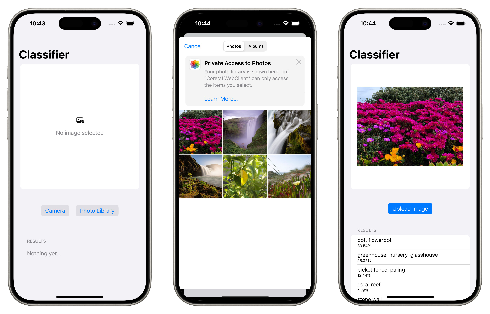

### coreml-web-api

# Deploy [CoreML](https://developer.apple.com/documentation/coreml) models on the server with [Vapor](https://vapor.codes/)

> This is a prototype project to demonstrate one way to deploy CoreML models on the server with Vapor. It is not intended for production use.

## Overview

This project demonstrates one way how to deploy a CoreML model on the server with Vapor. The project includes a simple Vapor server that accepts images and returns a prediction using a CoreML model. 
The model is a pre-trained [Resnet50](https://developer.apple.com/machine-learning/models/) model. The server uses this to classify the primary subject of images uploaded to the server.

### In the Box

- Server - Vapor server with CoreML model, and Dockerfile
- SwiftUI iOS client

## Prerequisites

- Xcode 15 (client)
- Swift 5.5

## Getting started

1. Clone repo
2. Open terminal and navigate to the project directory
3. Open the project with Xcode. `xed .`
4. `cd server && swift run App serve`
5. Back in Xcode, set the development team in `Signing & Capabilities` to your own team/profile
7. Select the `Run` scheme of your choice and run the project in Xcode
8. On simulator, select `Photo Library` then one of the default images, then `Upload Image`
9. Get results!

> NOTE: additional steps may (most likely will) be required to run the project on a physical device.
> see [The Serve Command](https://docs.vapor.codes/advanced/server/#serve-command) about binding to host and port.

--- 

Source code for the article [Deploy CoreML Models on the Server with Vapor](https://medium.com/@drewalth/deploy-coreml-models-on-the-server-with-vapor-48809a853fae)
